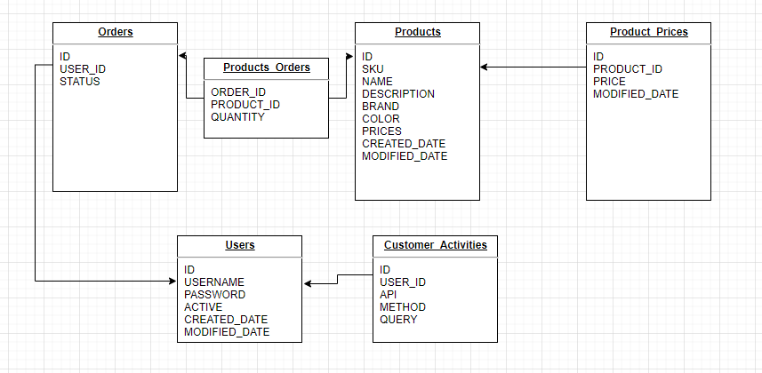

# I-Commerce Shopping Cart
REST API for I-Commerce Shopping Cart.

* [Requirements](#Requirements)
* [Database Diagram](#database-diagram)
* [Package Structure](#package-structure)
* [Running Locally](#running-locally)
* [API Definitions](#api-definitions)

### Requirements:
- Java 1.8
- Maven

### Database Diagram


### Package Structure
com.example.icommerce.ICommerceApplication.java - Main method for the application.
- com.example.icommerce
    - configurations - Configuration beans for the application.
    - constants - Declare constant variables to be used.
    - controllers - Controllers to handle requests coming from the client.
    - exceptions - Declare all exceptions.
    - models - Models of all the requests/responses.
    - repositories - Declare classes to process data into the database.
    - services - Declare classes to handle business logic.
- resources - application configuration files.
 ```
 application.properties
 ```
- **application.properties** : Default profile and setting.

### Running Locally
- Build package
```
mvn clean package
```
- Run project:
```
mvn spring-boot:run
```
For more details, please check in the page: https://spring.io/guides/gs/spring-boot/

### API Definitions
* [User](#users)
  * [POST /api/users](#post-apiusers)
  * [GET /api/users/activities](#get-apiusersactivities)
* [Product](#products)
  * [POST /api/products](#post-apiproducts)
  * [PUT /api/products](#put-apiproducts)
  * [GET /api/products](#get-apiproducts)
  * [DELETE /api/products](#delete-apiproducts)
* [Cart](#cart)
  * [GET /api/cart](#get-apicart)
  * [PUT /api/cart/add](#put-apicartadd)
  * [PUT /api/cart/remove](#put-apicartremove)
  * [GET /api/cart/checkout](#get-apicartcheckout)
* [Orders](#orders)
  * [Get /api/orders](#get-apiorders)

# Users

## POST /api/users

Creates a user

**Request fields**

| Field          | Type    | Description                             |
|:---------------|:--------|:----------------------------------------|
| username*      | String  | The Unique Username                     |
| password       | String  | The password                            |

**Request example:**

    {
      "name": "userunique",
      "password": "userpassword"
    }

**Response example:**

    {
      "data": {
        "username": "test",
        "active": true,
        "createdDate": "2021-02-28 18:06:31",
        "modifiedDate": "2021-02-28 18:06:31"
      }
    }

## GET /api/users/activities

Retrieve user activities information base on given user

**Request header fields**

| Field              | Type    | Description                      |
|:-------------------|:--------|:---------------------------------|
| X-Test-IdentityID  | String  | The username                     |

**Request example:**

    {
      "X-Test-IdentityID": "user"
    }

**Response example**

    {
      "data": [
        {
          "api": "/api/cart/add",
          "method": "PUT",
          "query": "productSku=sku"
        }
      ]
    }


# Require Request Header for below endpoints


| Field                 | Type    | Description                                                 |
|:----------------------|:--------|:------------------------------------------------------------|
| X-Test-IdentityID     | String  | The username to track activities                            |


# Products

## POST /api/products

Creates a product

**Request fields**

| Field          | Type    | Description                                                 |
|:---------------|:--------|:------------------------------------------------------------|
| productSku     | String  | The product SKU                                             |
| name*          | String  | The product name                                            |
| description    | String  | The product description                                     |
| brand          | String  | The product brand                                           |
| color          | String  | The product color                                           |
| price          | Double  | The product price                                           |

**Request example:**

    {
      "name": "Iphone",
      "description": "Iphone",
      "brand": "Apple",
      "color": "White",
      "price": 1000000000
    }

**Response fields:**

| Field           | Type   | Description                                  |
|:----------------|--------|----------------------------------------------|
| createdDate     | String  | The product creation date.                  |
| modifiedDate    | String  | The product modification date.              |
| active          | boolean | The Product activation.                     |
| *               | *       | All fields described in the request.        |

**Response example:**

    {
      "sku": "ICMIPH000001",
      "name": "Iphone",
      "description": "Iphone",
      "brand": "Apple",
      "color": "White",
      "price": 1000000000,
      "active": true,
      "createdDate": "2020-10-10 00:00:00",
      "modifiedDate": "2020-10-10 00:00:00"
    }

## PUT /api/products

Update a product

**Request fields**

| Field          | Type    | Description                                                 |
|:---------------|:--------|:------------------------------------------------------------|
| productSku*    | String  | The product SKU                                             |
| name           | String  | The product name                                            |
| description    | String  | The product description                                     |
| brand          | String  | The product brand                                           |
| color          | String  | The product color                                           |
| price          | Double  | The product price                                           |

**Request example:**

    {
      "sku": "ICMIPH000001",
      "name": "Iphone",
      "description": "Iphone",
      "brand": "Apple",
      "color": "White",
      "price": 10000300
    }

**Response fields:**

| Field           | Type   | Description                                  |
|:----------------|--------|----------------------------------------------|
| createdDate     | String  | The product creation date.                  |
| modifiedDate    | String  | The product modification date.              |
| active          | boolean | The Product activation.                     |
| *               | *       | All fields described in the request.        |

**Response example:**

    {
      "sku": "ICMIPH000001",
      "name": "Iphone",
      "description": "Iphone",
      "brand": "Apple",
      "color": "White",
      "price": 10000300,
      "active": true,
      "createdDate": "2020-10-10 00:00:00",
      "modifiedDate": "2020-10-11 00:00:00"
    }

## GET /api/products

Get products

**Request fields**

| Field          | Type    | Description                                                                                                                         |
|:---------------|:--------|:------------------------------------------------------------------------------------------------------------------------------------|
| productSku     | String  | Filter by product SKU                                                                                                               |
| name           | String  | Filter by product name                                                                                                              |
| brand          | String  | Filter by product brand                                                                                                             |
| color          | String  | Filter by product color                                                                                                             |
| price          | Double  | Filter by product price                                                                                                             |
| page           | Integer | Page number request, it is counted from 0                                                                                           |
| limit          | Integer | If specified, then the resultset will be limit to the size of the specified. (Default = 20)                                         |
| sortBy         | String  | Support sort by field name returned from API, only fieldName will sort Asc, `-` will sort  Desc. Default field is **Created_Date**  |

**Request example:**

    {
      "name": "Iphone",
      "brand": "Apple",
      "color": "White",
      "price": 10000,
      "page": 0,
      "limit": 1,
      "sortBy": "10000"
    }

**Response example:**

    {
      "data" : [
        {
          "sku": "ICMIPH000001",
          "name": "Iphone",
          "description": "Iphone",
          "brand": "Apple",
          "color": "White",
          "price": 10000300,
          "active": true,
          "createdDate": "2020-10-10 00:00:00",
          "modifiedDate": "2020-10-11 00:00:00"
        }
      ],
      "paging": {
        "page": 0,
        "limit": 1,
        "totalPage": 100
      }
    }

## DELETE /api/products

Delete a product

**Request fields**

| Field          | Type    | Description                                                 |
|:---------------|:--------|:------------------------------------------------------------|
| productSku*    | String  | The product SKU                                             |

**Request example:**

    {
      "sku": "ICMIPH000001"
    }

**Response fields:**

| Field           | Type   | Description                                  |
|:----------------|--------|----------------------------------------------|
| status          | String  | Status of product deletion.                 |

**Response example:**

    {
      "status": "SUCCEED",
    }

# Cart

## GET /api/cart

View cart information

**Request fields**

**Request example:**

**Response example:**

    {
      "data": {
        "total": "0",
        "order": []
      }
    }

## PUT /api/cart/add

Put a product into Cart

**Request fields**

| Field          | Type    | Description                                                 |
|:---------------|:--------|:------------------------------------------------------------|
| productSku*    | String  | The product SKU                                             |

**Request example:**

    {
      "productSku": "ICMIPH000001"
    }

**Response example:**

    {
      "data": {
        "total": "10000300.0",
        "order": [
          "product": {
            "sku": "ICMIPH000001",
            "name": "Iphone",
            "description": "Iphone",
            "brand": "Apple",
            "color": "White",
            "price": 10000300,
            "active": true,
            "createdDate": "2020-10-10 00:00:00",
            "modifiedDate": "2020-10-11 00:00:00"
          },
          "quantity": 1
        ]
      }
    }

## PUT /api/cart/remove

Remove a product out of Cart

**Request fields**

| Field          | Type    | Description                                                 |
|:---------------|:--------|:------------------------------------------------------------|
| productSku*    | String  | The product SKU                                             |

**Request example:**

    {
      "productSku": "ICMIPH000001"
    }

**Response example:**

    {
      "data": {
        "total": "0",
        "order": []
      }
    }

## GET /api/cart/checkout

Checkout. This will create an order

**Request header fields**

| Field              | Type    | Description                      |
|:-------------------|:--------|:---------------------------------|
| X-Test-IdentityID  | String  | The username                     |

**Request example:**

    {
      "X-Test-IdentityID": "user"
    }

**Response example:**

    {
      "data": {
        "orderNumber": "ICM000000002",
        "status": "PROCESSING",
        "details": [
          {
            "product": {
              "sku": "ICMAIP000003",
              "name": "Iphone 31",
              "description": "This is description of Iphone 31",
              "brand": "Apple",
              "color": "Brown",
              "price": 6216.0,
              "active": true,
              "createdDate": "2021-02-28 16:40:09",
              "modifiedDate": "2021-02-28 16:40:09"
            },
            "quantity": 3
          }
        ],
        "total": 18648
      }
    }

# Orders

## GET /api/orders

Retrieve order information base on given user

**Request header fields**

| Field              | Type    | Description                      |
|:-------------------|:--------|:---------------------------------|
| X-Test-IdentityID  | String  | The username                     |

**Request example:**

    {
      "X-Test-IdentityID": "user"
    }

**Response example:**

    {
      "data": [
        {
        "orderNumber": "ICM000000002",
        "status": "PROCESSING",
        "details": [
          {
           "product": {
              "sku": "ICMAIP000003",
              "name": "Iphone 87",
              "description": "This is description of Iphone 87",
              "brand": "Apple",
              "color": "Orange",
              "price": 4219.0,
              "active": true,
              "createdDate": "2021-02-28 17:55:23",
              "modifiedDate": "2021-02-28 17:55:23"
            },
            "quantity": 2
          }
        ],
        "total": 8438
        }
      ]
    }
